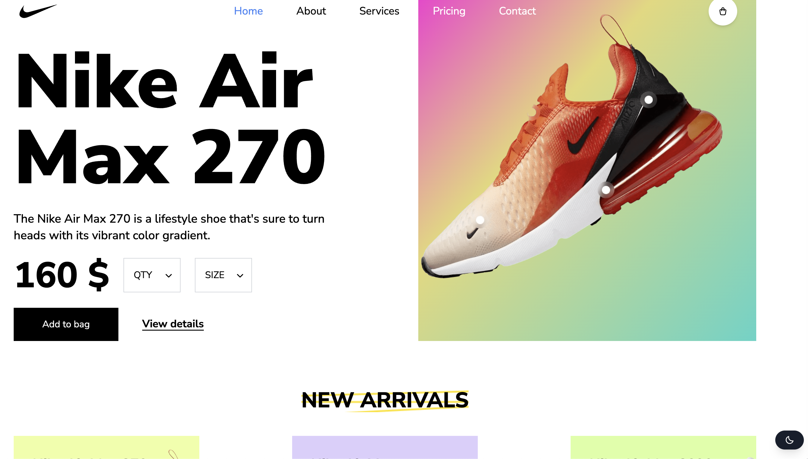

# 🏀 Nike Shoes Online Market

Welcome to **Nike Shoes Online Market** — a sleek, blazing-fast online storefront built with modern frontend tech and serious sneakerhead vibes.

 <!-- Optional: Add a screenshot of your app -->

---

## 🚀 Live Demo

👉 [Click here to view the live site](https://vladikhan.github.io/tailwindNike/)

---

## 🛠️ Built With

- ⚛️ [React](https://reactjs.org/)
- ⚡ [Vite](https://vitejs.dev/)
- 🔥 [Next.js](https://nextjs.org/)
- 🎨 [Tailwind CSS](https://tailwindcss.com/)
- 🧠 [Babel](https://babeljs.io/) – because modern JavaScript is a vibe

---

## 📦 Features

- 🛍 Browse a collection of Nike shoes
- 🔍 Search & filter products
- 🧺 Add to cart functionality
- 🖥️ Fully responsive design
- ⚡ Super fast performance with Vite

---

## 🧑‍💻 Getting Started

### 1. Clone the repo

```bash
git clone https://github.com/vladikhan/nike-shop.git
cd nike-shop
